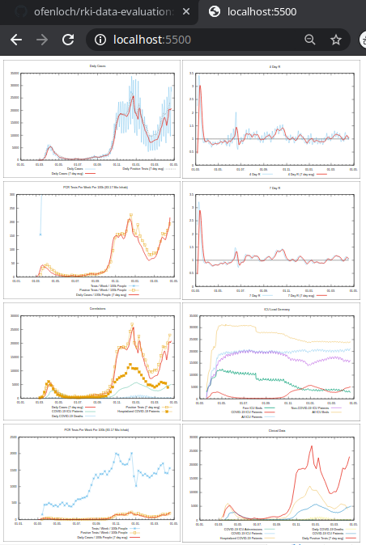

# My Evaluation of RKI's COVID-19 Data



My personal oppinion is that we should not take the "7-Tage-Inzidenz" as criterion for [NPI](https://en.wikipedia.org/wiki/Non-pharmaceutical_intervention_(epidemiology)) but a combination of ICU admission rate and hospaitalization rate.

For convenience, there's an **index.html** showing the generated plots. I use VS Code Extension 
[Live Server](https://marketplace.visualstudio.com/items?itemName=ritwickdey.LiveServer) to check the plots in a browser.
## Daily **download** of RKI Excel file via cron with bash script **getRKIData.sh**

    # every day at 05:03 download Corona data from RKI
    03 05  *   *   *     /home/ofenloch/workspaces/COVID19/rki-data-evaluation/getRKIData.sh 2>&1 | tee -a /home/ofenloch/workspaces/COVID19/rki-data-evaluation/getRKIData.sh.cron.log 2>&1

## Plot Generation

The script **plot-data.sh** processes the extracted CSV file and generates the plots. The script does all the 
things that are described in more detail below.


## The data in the Excel files is **extracted into CSV** file by

    xlsx2csv --all --delimiter ";" --dateformat %Y-%m-%d FileName.xlsx FileName-csv

```bash
ofenloch@teben:~/workspaces/COVID19/rki-data-evaluation/rki-data$ for f in *.xlsx ; do xlsx2csv --all --delimiter ";" --dateformat %Y-%m-%d ${f} $(basename ${f} .xlsx)-csv ; done 
ofenloch@teben:~/workspaces/COVID19/rki-data-evaluation/rki-data$ git status
On branch master
Changes not staged for commit:
  (use "git add <file>..." to update what will be committed)
  (use "git restore <file>..." to discard changes in working directory)
        modified:   RKI-Fallzahlen_Kum_Tab-csv/7Tage_LK.csv
        modified:   RKI-Fallzahlen_Kum_Tab-csv/BL_7-Tage-Fallzahlen.csv
        modified:   RKI-Fallzahlen_Kum_Tab-csv/BL_7-Tage-Inzidenz.csv
        modified:   "RKI-Fallzahlen_Kum_Tab-csv/F\303\244lle-Todesf\303\244lle-gesamt.csv"
        modified:   RKI-Fallzahlen_Kum_Tab-csv/Tageswerte berechnet.csv
        modified:   RKI-Fallzahlen_Kum_Tab.xlsx
        modified:   "RKI-Nowcasting_Zahlen-csv/Erl\303\244uterung.csv"
        modified:   RKI-Nowcasting_Zahlen-csv/Nowcast_R.csv
        modified:   RKI-Nowcasting_Zahlen.xlsx

no changes added to commit (use "git add" and/or "git commit -a")
ofenloch@teben:~/workspaces/COVID19/rki-data-evaluation/rki-data$ 
```

The sheet names change sometimes. Sometimes new sheets are added.

The data about the PCR tests is only given per week. I assume, RKI uses ISO week numbers for this information:
* year 2020 ends with week number 53
* year 2021 starts with week 01

ISO week 53/2020 starts with Monday, 2020-12-28, and ends with Sunday, 2021-01-03.
ISO week 01/2021 starts with Monday, 2021-01-04, and ends with Sunday, 2021-01-10.

So, we use this

    ofenloch@teben:~/workspaces/COVID19/rki-eval/rki-data$ ncal -w -M -y 2020
                                    2020
        Januar            Februar           März              April             
    Mo     6 13 20 27        3 10 17 24        2  9 16 23 30     6 13 20 27   
    Di     7 14 21 28        4 11 18 25        3 10 17 24 31     7 14 21 28   
    Mi  1  8 15 22 29        5 12 19 26        4 11 18 25     1  8 15 22 29   
    Do  2  9 16 23 30        6 13 20 27        5 12 19 26     2  9 16 23 30   
    Fr  3 10 17 24 31        7 14 21 28        6 13 20 27     3 10 17 24      
    Sa  4 11 18 25        1  8 15 22 29        7 14 21 28     4 11 18 25      
    So  5 12 19 26        2  9 16 23        1  8 15 22 29     5 12 19 26      
        1  2  3  4  5     5  6  7  8  9     9 10 11 12 13 14 14 15 16 17 18   

        Mai               Juni              Juli              August            
    Mo     4 11 18 25     1  8 15 22 29        6 13 20 27        3 10 17 24 31
    Di     5 12 19 26     2  9 16 23 30        7 14 21 28        4 11 18 25   
    Mi     6 13 20 27     3 10 17 24        1  8 15 22 29        5 12 19 26   
    Do     7 14 21 28     4 11 18 25        2  9 16 23 30        6 13 20 27   
    Fr  1  8 15 22 29     5 12 19 26        3 10 17 24 31        7 14 21 28   
    Sa  2  9 16 23 30     6 13 20 27        4 11 18 25        1  8 15 22 29   
    So  3 10 17 24 31     7 14 21 28        5 12 19 26        2  9 16 23 30   
       18 19 20 21 22    23 24 25 26 27    27 28 29 30 31    31 32 33 34 35 36

        September         Oktober           November          Dezember          
    Mo     7 14 21 28        5 12 19 26        2  9 16 23 30     7 14 21 28   
    Di  1  8 15 22 29        6 13 20 27        3 10 17 24     1  8 15 22 29   
    Mi  2  9 16 23 30        7 14 21 28        4 11 18 25     2  9 16 23 30   
    Do  3 10 17 24        1  8 15 22 29        5 12 19 26     3 10 17 24 31   
    Fr  4 11 18 25        2  9 16 23 30        6 13 20 27     4 11 18 25      
    Sa  5 12 19 26        3 10 17 24 31        7 14 21 28     5 12 19 26      
    So  6 13 20 27        4 11 18 25        1  8 15 22 29     6 13 20 27      
       36 37 38 39 40    40 41 42 43 44    44 45 46 47 48 49 49 50 51 52 53   
    ofenloch@teben:~/workspaces/COVID19/rki-eval/rki-data$ ncal -w -M -y 2021
                                    2021
        Januar            Februar           März              April             
    Mo     4 11 18 25     1  8 15 22        1  8 15 22 29        5 12 19 26   
    Di     5 12 19 26     2  9 16 23        2  9 16 23 30        6 13 20 27   
    Mi     6 13 20 27     3 10 17 24        3 10 17 24 31        7 14 21 28   
    Do     7 14 21 28     4 11 18 25        4 11 18 25        1  8 15 22 29   
    Fr  1  8 15 22 29     5 12 19 26        5 12 19 26        2  9 16 23 30   
    Sa  2  9 16 23 30     6 13 20 27        6 13 20 27        3 10 17 24      
    So  3 10 17 24 31     7 14 21 28        7 14 21 28        4 11 18 25      
       53  1  2  3  4     5  6  7  8        9 10 11 12 13    13 14 15 16 17   

        Mai               Juni              Juli              August            
    Mo     3 10 17 24 31     7 14 21 28        5 12 19 26        2  9 16 23 30
    Di     4 11 18 25     1  8 15 22 29        6 13 20 27        3 10 17 24 31
    Mi     5 12 19 26     2  9 16 23 30        7 14 21 28        4 11 18 25   
    Do     6 13 20 27     3 10 17 24        1  8 15 22 29        5 12 19 26   
    Fr     7 14 21 28     4 11 18 25        2  9 16 23 30        6 13 20 27   
    Sa  1  8 15 22 29     5 12 19 26        3 10 17 24 31        7 14 21 28   
    So  2  9 16 23 30     6 13 20 27        4 11 18 25        1  8 15 22 29   
       17 18 19 20 21 22 22 23 24 25 26    26 27 28 29 30    30 31 32 33 34 35

        September         Oktober           November          Dezember          
    Mo     6 13 20 27        4 11 18 25     1  8 15 22 29        6 13 20 27   
    Di     7 14 21 28        5 12 19 26     2  9 16 23 30        7 14 21 28   
    Mi  1  8 15 22 29        6 13 20 27     3 10 17 24        1  8 15 22 29   
    Do  2  9 16 23 30        7 14 21 28     4 11 18 25        2  9 16 23 30   
    Fr  3 10 17 24        1  8 15 22 29     5 12 19 26        3 10 17 24 31   
    Sa  4 11 18 25        2  9 16 23 30     6 13 20 27        4 11 18 25      
    So  5 12 19 26        3 10 17 24 31     7 14 21 28        5 12 19 26      
       35 36 37 38 39    39 40 41 42 43    44 45 46 47 48    48 49 50 51 52   
    ofenloch@teben:~/workspaces/COVID19/rki-eval/rki-data$ 

## Plotting with GnuPlot

The **Gnuplot command file** is **plot-data.plt**

